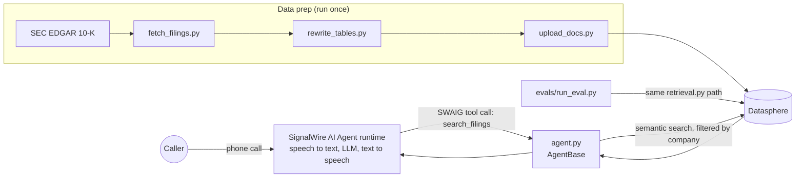

# Filings Voice Agent

A phone number you can call to ask questions about a company's SEC 10-K. Built on SignalWire's AI Agent runtime with Datasphere as the knowledge base.

Ask *"What were Apple's iPhone sales in fiscal 2024?"* and it searches the filing and answers *"about $201.2 billion, according to their 10-K."* It only states numbers it actually finds.

The part I spent the most time on is the eval. On 24 questions with known answers, retrieval found the right passage **29%** of the time on the first version and **96%** after three rounds of fixes. Details below.

**Demo video:** [watch the call (Google Drive)](https://drive.google.com/file/d/1atW-OHIiUXEpGx4Hwdlg4jBtUhrlbEPA/view?usp=sharing)

Covers NVIDIA (fiscal 2025 10-K) and Apple (fiscal 2024 10-K).

## How it works



- **`agent.py`**: the voice agent. One SWAIG tool, `search_filings`. The prompt requires a search before every answer and forbids stating numbers that aren't in the results. Filler phrases play while the search runs.
- **`retrieval.py`**: Datasphere search filtered by company tag. The agent and the eval both call this, so the eval tests the exact path a live call uses.
- **`fetch_filings.py`**: pulls each 10-K from SEC EDGAR and converts the HTML to text.
- **`rewrite_tables.py`**: rewrites every table row as a self-describing sentence (company, statement, fiscal year, units) and writes a prose-only copy with raw table rows removed.
- **`upload_docs.py`**: loads both files into Datasphere with different chunking (one table row per chunk, 8-sentence prose chunks).
- **`check_answers.py`**: confirms every expected answer is really in the filing, so an eval miss means retrieval failed, not that the question was wrong.
- **`evals/run_eval.py`**: runs the 24 questions and reports hit@1 and hit@3 by question type, plus what came back for every miss.

## Eval: 29% to 96%

24 questions with known answers (checked against the filings by `check_answers.py`). A hit means a chunk containing the exact answer came back in the top 1 or top 3 search results.

| Question type | n | v1 hit@3 | v2 hit@3 | v3 hit@1 | v3 hit@3 |
|---|---|---|---|---|---|
| Income statement | 7 | 0% | 86% | 86% | **100%** |
| Segment tables | 9 | 11% | 22% | 78% | **100%** |
| Plain text | 8 | 75% | 62% | 75% | **88%** |
| **All** | 24 | 29% | 54% | 79% | **96%** |

**v1, raw 10-K text, default chunking.** Text questions were fine but financial numbers were almost never found. Two reasons. Flattened tables lose their context: a row like `Revenue | $ | 130,497 | $ | 60,922` has no company, year or statement name for a question to match. And default chunking cut each 10-K into only 19 to 32 chunks, so every chunk mixed dozens of unrelated topics.

**v2, tables rewritten as sentences** (`rewrite_tables.py`). Each row now carries its company, statement, fiscal year and units: `NVIDIA fiscal 2025 10-K, Consolidated Statements of Income | Revenue: fiscal year ended Jan 26, 2025: $130,497 million; ...`. Income statement questions went from 0% to 86%. Segment tables barely moved, and text questions dropped, because the new sentences were still packed into huge chunks next to table-of-contents and exhibit-index rows.

**v3, chunking fixed.** One table row per chunk, prose in 8-sentence chunks (a few hundred chunks per filing instead of ~25), raw table rows removed from the prose, and non-financial rows (table of contents, exhibit index) dropped. Everything moved up together.

**Remaining miss:** "When did NVIDIA's fiscal year 2025 end?" returns an unrelated table row (a tax reserve balance) whose label says "fiscal year ended Jan 26, 2025". The date is technically there, abbreviated, but the eval is a strict string match on "January 26, 2025" and the prose sentence that states it directly didn't rank, so it counts as a miss.

**Takeaway:** in v1 the retrieval quality problem was mostly a data preparation problem, not a model problem. Measuring by question type showed exactly where it broke.

## Latency

Measured on live calls with a timer around the tool call: each Datasphere search takes **1.4 to 1.6 s**
round trip from the agent server. The rest of the pause is the model choosing to search and generating speech.
The tool has filler phrases ("Let me check the filing") so the caller doesn't sit in silence.

One thing the logs showed: the model sometimes calls `search_filings` twice with the same query,
which doubles the wait. Caching recent results per call, or tightening the tool description, would fix that.

## Limitations

- The eval measures **retrieval** (did the right passage come back), not the spoken answer. On live calls the answers I checked were correct, but that's spot checking, not a scored eval.
- Matching is a strict string match on the expected value, which is why the one remaining miss counts as a miss.
- Two companies, one filing each, 24 questions. Enough to find and fix real failure modes, not enough to call it general.
- The agent runs on my laptop behind ngrok, so the number only works while it's running.

## What I'd do next

- Move retrieval onto SignalWire with the serverless Datasphere skill (one instance per company tag), so search doesn't round trip through my server.
- Score the spoken answers too: replay the eval questions through the agent and grade the final responses, not just retrieval.
- Cache search results within a call to stop duplicate tool calls.
- Add more companies and multi-year questions ("how did NVIDIA's data center revenue change from 2024 to 2025?").

## Run it yourself

You need a SignalWire space, a public GitHub repo for the filings (Datasphere fetches them by URL), and ngrok.

```bash
pip install -r requirements.txt
cp .env.example .env          # add your SignalWire project ID, API token, space, repo, and a password

python fetch_filings.py        # download the 10-Ks from EDGAR
python rewrite_tables.py       # table rows to sentences, plus prose-only copy
python check_answers.py        # should print 24/24
git add filings && git commit -m "filings" && git push
python upload_docs.py          # load into Datasphere
python evals/run_eval.py v3    # run the eval
```

To take calls:

```bash
ngrok http 3000                # in one terminal, then put the https URL in SWML_PROXY_URL_BASE
python agent.py                # in another terminal
```

In the SignalWire dashboard, buy a number, assign it a **SWML Script** resource that handles calls from an external URL, and set the URL to `https://agent:<password>@<your-ngrok-url>/filings`.

Test a tool call without a phone:

```bash
swaig-test agent.py --exec search_filings --query "iPhone net sales" --company aapl
```
